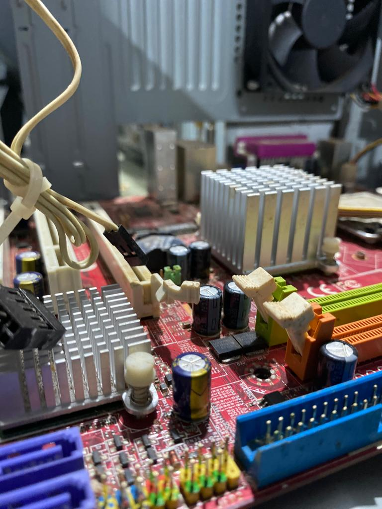

# Relatórios Manutenção e Montagem de computadores 
## Aula 3
### Jomiscley Lima 

Status: A máquina não estava funcionando.
|----------   |-------|---------------
|Placa-mãe    | sim   | ITAUTEC
|Memória RAM  | Não   | -
|Disco Rígido | Sim   | SONY, 40GB 
|Fonte        | nao   | - 
|Gabinete     | sim   | CCE
|Hard-Drive   | nao   | -
|Processador  | Sim   | INTEL, família ATOM

